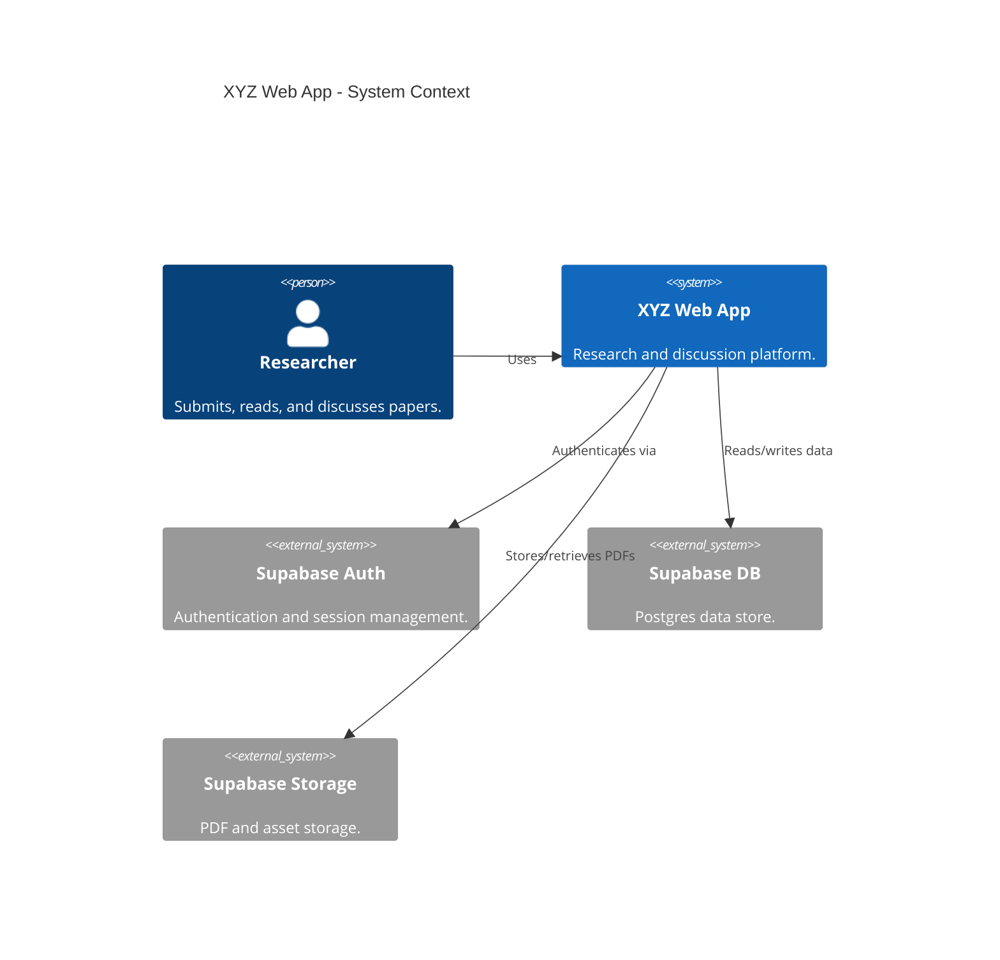

# System Overview

## Context

```mermaid
C4Context
title XYZ Web App - System Context
Person(researcher, "Researcher", "Submits, reads, and discusses papers.")
System(xyz, "XYZ Web App", "Research and discussion platform.")
System_Ext(supabase_auth, "Supabase Auth", "Authentication and session management.")
System_Ext(supabase_db, "Supabase DB", "Postgres data store.")
System_Ext(supabase_storage, "Supabase Storage", "PDF and asset storage.")

Rel(researcher, xyz, "Uses")
Rel(xyz, supabase_auth, "Authenticates via")
Rel(xyz, supabase_db, "Reads/writes data")
Rel(xyz, supabase_storage, "Stores/retrieves PDFs")
```
