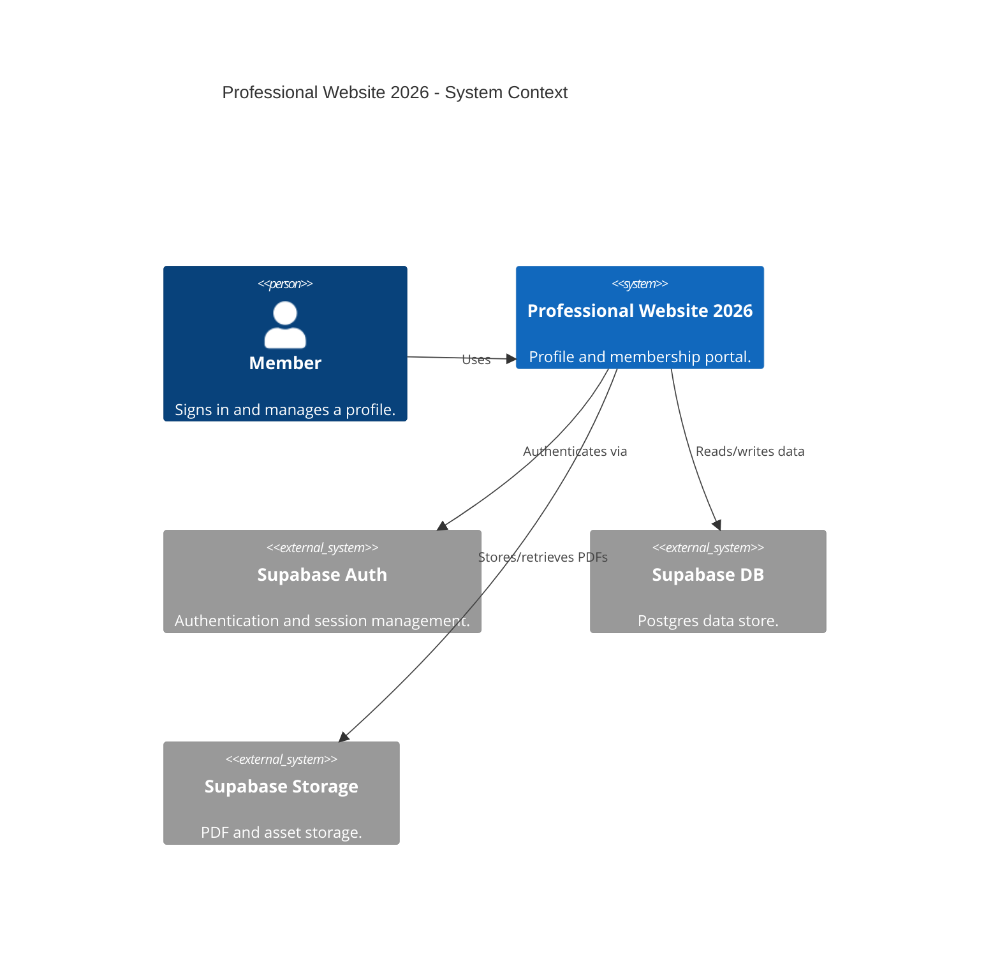

# System Overview

## Context

```mermaid
C4Context
title Professional Website 2026 - System Context
Person(member, "Member", "Signs in and manages a profile.")
System(site, "Professional Website 2026", "Profile and membership portal.")
System_Ext(supabase_auth, "Supabase Auth", "Authentication and session management.")
System_Ext(supabase_db, "Supabase DB", "Postgres data store.")
System_Ext(supabase_storage, "Supabase Storage", "PDF and asset storage.")

Rel(member, site, "Uses")
Rel(site, supabase_auth, "Authenticates via")
Rel(site, supabase_db, "Reads/writes data")
Rel(site, supabase_storage, "Stores/retrieves PDFs")
```
