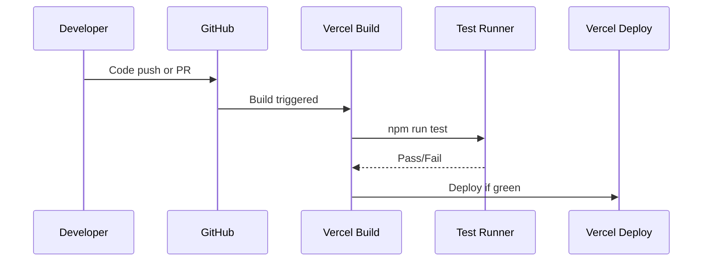

# CI/CD Workflow

Notes:
- GitHub Actions runs `npm run test` on pull requests.
- Vercel builds and deploys on main branch updates.

```mermaid
sequenceDiagram
    participant Dev as Developer
    participant Git as GitHub
    participant Vercel as Vercel Build
    participant Tests as Test Runner
    participant Deploy as Vercel Deploy

    Dev->>Git: Code push or PR
    Git->>Vercel: Build triggered
    Vercel->>Tests: npm run test
    Tests-->>Vercel: Pass/Fail
    Vercel->>Deploy: Deploy if green
```
