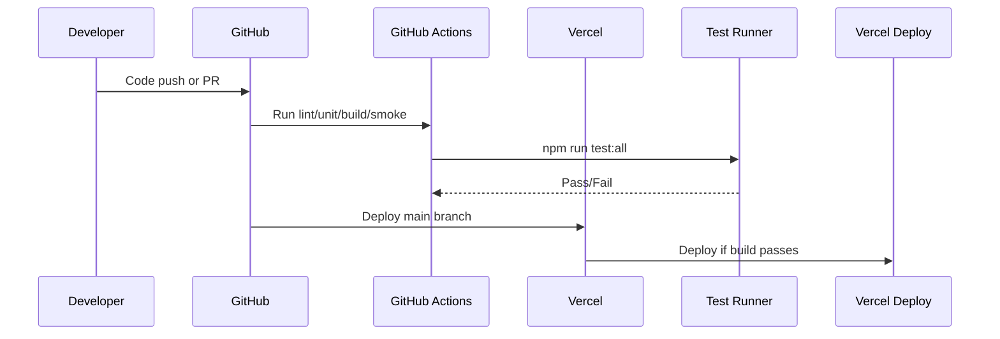

# CI/CD Workflow

Notes:
- GitHub Actions runs `npm run lint`, `npm run test`, `npm run build`, and `npm run test:smoke` on push/PR.
- Vercel builds and deploys on main branch updates.

```mermaid
sequenceDiagram
    participant Dev as Developer
    participant Git as GitHub
    participant CI as GitHub Actions
    participant Vercel as Vercel
    participant Tests as Test Runner
    participant Deploy as Vercel Deploy

    Dev->>Git: Code push or PR
    Git->>CI: Run lint/unit/build/smoke
    CI->>Tests: npm run test:all
    Tests-->>CI: Pass/Fail
    Git->>Vercel: Deploy main branch
    Vercel->>Deploy: Deploy if build passes
```
